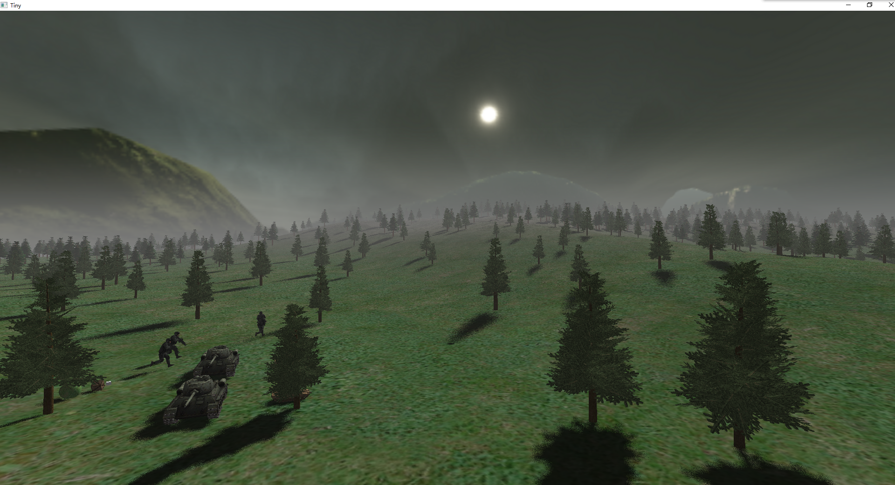

# Tiny3D
A Small OpenGL Based Renderer

### Features:  

- OpenGL3.3 based

- Instanced rendering supported

- Post processing supported

- .obj model file supported

- .bmp texture file supported

- Skeleton animation supported

- Cascaded shadow map

- Sky dome  

- Multi-thread support  

### Screenshot:

