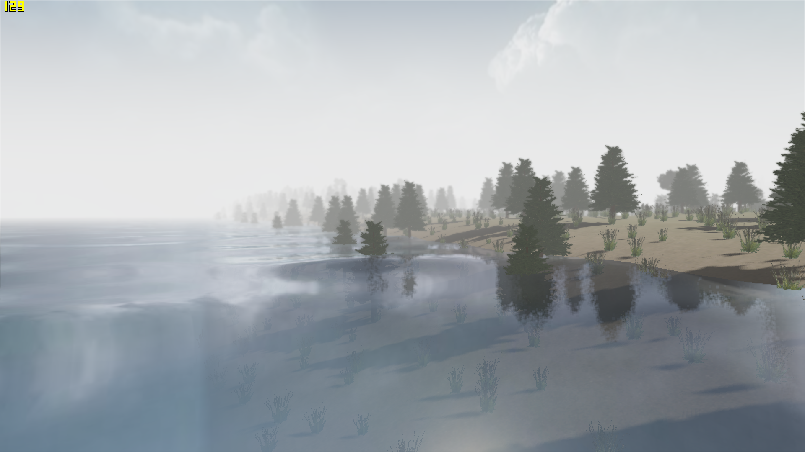

# Tiny3D
A Small OpenGL Based Renderer  

### Features:    

- OpenGL3.3 based  
- Instanced rendering  
- Post processing  
- .obj model file    
- .bmp texture file  
- Skeleton animation  
- Cascaded shadow map
- Sky dome  
- Multi-thread support  
- Deferred shading  
- Dynamic Level of Detail  
- Billboard  
- Water  
- Fog  
- Depth of Field  
- Antialiasing  
- Screen Space Reflection  
- Screen Space Grass  
- PBR Material

### Screenshot:  

   

  